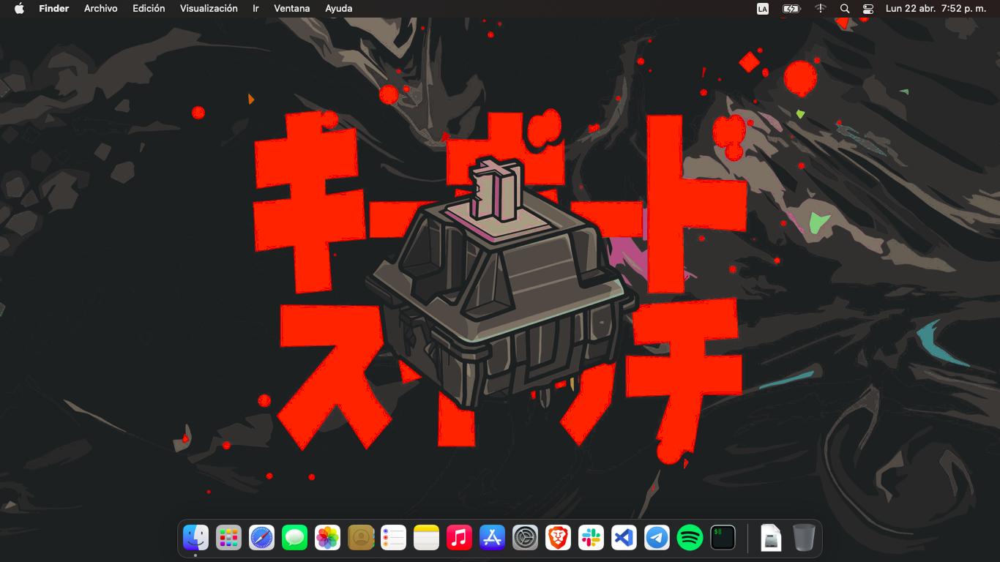
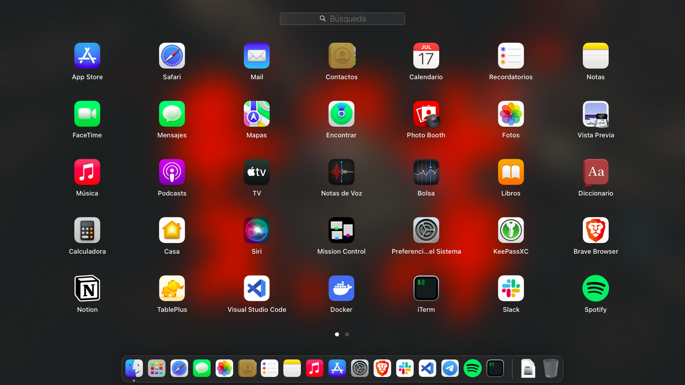
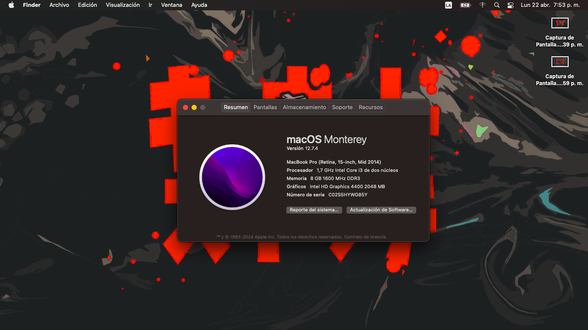
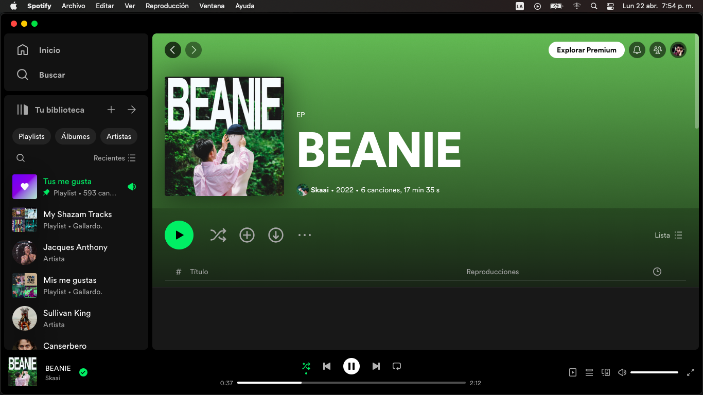
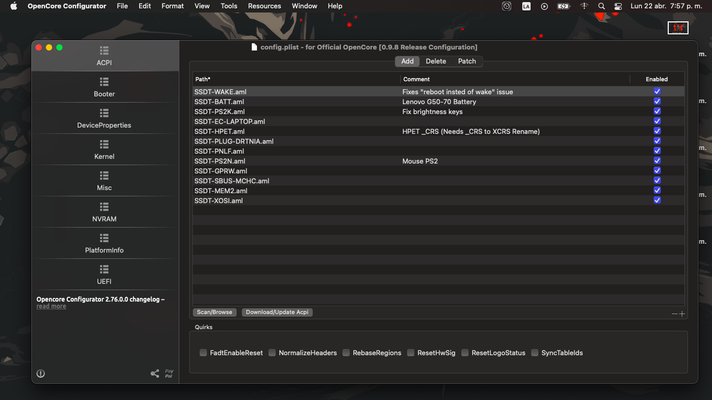
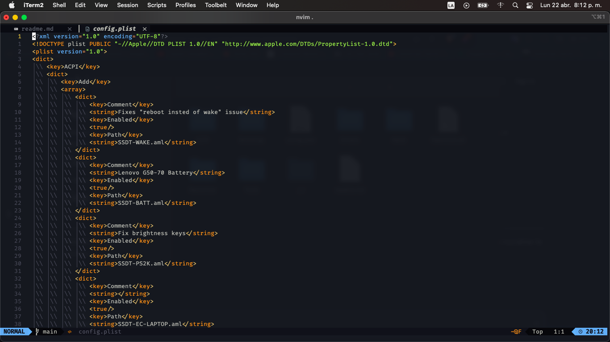

# OpenCore for Lenovo Z40-70

This repository contains the OpenCore configuration for installing macOS on a Lenovo Z40-70. This project is designed for those who wish to experiment with macOS on non-official hardware.

## Requirements

-   Lenovo Z40-70
-   macOS High Sierra or Monterrey
-   Boot tools (such as Clover Configurator or OpenCore Configurator)

## Installation Instructions

1. **Download macOS**: Ensure you have a copy of macOS High Sierra or higher. You can obtain it from the App Store or download it from a reliable source.

2. **Prepare the Installation USB**: Format a USB of at least 16GB in APFS format. Use a tool like Clover Configurator or OpenCore Configurator to create a bootable USB with macOS.

3. **OpenCore Configuration**: Copy the OpenCore configuration files from this repository to the EFI directory on your bootable USB. Ensure the configuration is compatible with your hardware.

4. **Boot from USB**: Restart your Lenovo Z40-70 and boot from the USB. You can do this by pressing the function key (F12) during boot and selecting the USB as the boot device.

5. **Install macOS**: Follow the on-screen instructions to install macOS on your Lenovo Z40-70.

## Customization

This repository includes a basic OpenCore configuration for the Lenovo Z40-70. You can customize the configuration according to your needs, such as adding support for additional hardware or changing the boot configuration.

## Preview

## Contributions

If you encounter issues or have suggestions to improve this configuration, please open an issue or a pull request.

## License

This project is licensed under the MIT license. See the `LICENSE` file for more details.
